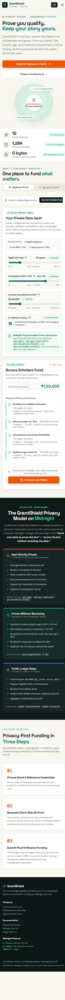
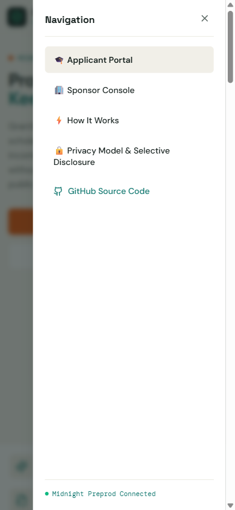
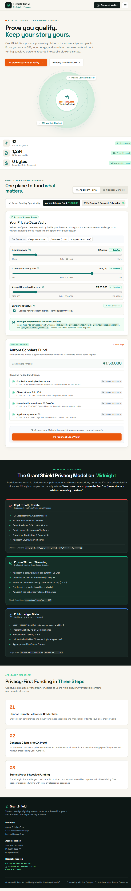
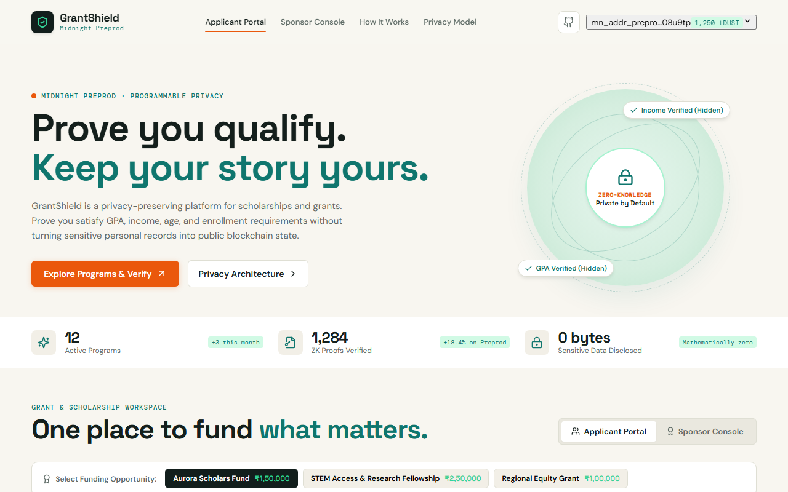
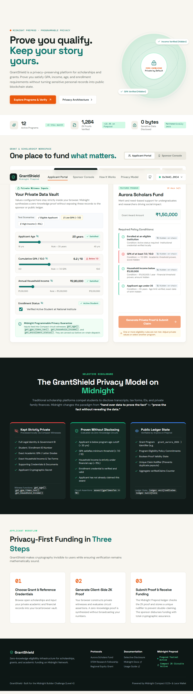
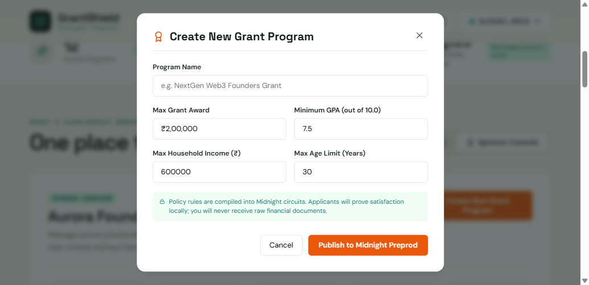
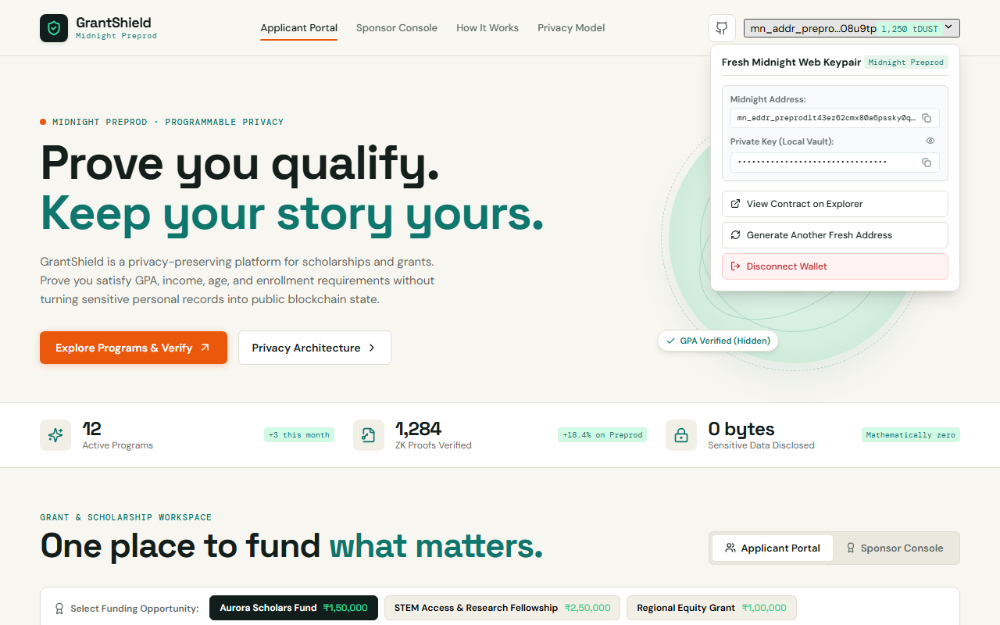

# GrantShield

[](https://github.com/Shashiverm/grantshield/actions/workflows/ci.yml)

> Prove you qualify for scholarships and grants without exposing the sensitive personal, academic, or financial records behind it.

---

## Live Demo


---

## Contract Address

| Network | Address | Explorer Link |
| :--- | :--- | :--- |
| **Midnight Preprod** | `020027f1074e1244fa824da668cbdb29d12c89dd35fc8f380cf8f8ecd3da54c02f94` | [Open Midnight Preprod Explorer](https://explorer.preprod.midnight.network/contract/020027f1074e1244fa824da668cbdb29d12c89dd35fc8f380cf8f8ecd3da54c02f94) |

- **Deployer Account:** `mn_addr_preprod16alt42dnwerz6cy4w9wu65z7z3pyvfldeuvf2h7gas8uumygq9ms8x0s67`
- **Deployment Transaction Hash:** `0x092ce234e98fe235041c6174e7830e8c6cd509659d9e67a76b8259070b083f2b`
- **Consensus Block Height:** `2,689,750`
- **Consensus Block Hash:** `9ae9ca8d421bf19ecdf955e4706bada79cc3b01d42fa4a79dbeb0d8700dc7384`
- **ZKIR Circuit Verified:** `verify_eligibility` (Compact 0.5.2)

---

## What This Product Does

GrantShield is a privacy-preserving infrastructure for scholarships, grants, fellowships, and financial-aid programs. In the traditional funding model, applicants are required to disclose sensitive records—such as transcripts, GPA, family income tax returns, government IDs, and enrollment certificates—to multiple sponsors and verification portals. Verifiers rarely need to know the applicant's exact financial or academic records; they only need mathematical certainty that the applicant satisfies the program's eligibility thresholds.

GrantShield flips this paradigm from **"share your raw data to prove the fact"** to **"prove the fact without unnecessarily revealing the data."** Applicants keep all sensitive records in their local browser vault and generate a zero-knowledge proof verifying that their GPA meets or exceeds the required threshold, household income falls under the financial cap, age is within limits, and active enrollment is valid.

Midnight is uniquely suited for GrantShield because the challenge is not merely storing encrypted documents on a distributed ledger. Midnight's programmable privacy allows the execution of Compact zero-knowledge circuits where sensitive applicant inputs are supplied as private witnesses, while the public ledger tracks only the program policy commitments, proof validity, and a cryptographic nullifier to prevent double claims.

---

## Privacy Model

GrantShield is built around **selective disclosure**:

### What is PUBLIC (on-chain, anyone can see):
- **Grant Program Identifier:** Unique on-chain ID for the grant program (e.g. `grant_aurora_2026`).
- **Eligibility Policy Commitments:** Public program thresholds and rules (maximum age, minimum GPA, maximum income).
- **Proof Validity:** A boolean confirmation that the zero-knowledge circuit assertions passed.
- **Claim Status & Counters:** The aggregate `verifiedClaims` ledger counter.
- **Cryptographic Nullifiers:** Unique hashes stored in `ledger nullifiers: Set<Bytes<32>>` to prevent duplicate claims.

### What is PRIVATE (private witness, never on-chain):
- **Applicant Identity & Government ID:** Full name, roll number, and government identification.
- **Exact Cumulative GPA:** Academic marks (e.g. `8.4 / 10.0`) remain local.
- **Exact Household Income:** Annual family earnings and tax documents (e.g. `₹3,20,000`) remain local.
- **Applicant Age / Date of Birth:** Exact age (e.g. `22 years`) remains local.
- **Applicant Secrets:** Client-side private salt used to derive the one-way nullifier.

### What the user PROVES without revealing:
- ✓ Applicant age satisfies the program constraint (`age < 35`).
- ✓ Applicant GPA meets or exceeds the minimum cutoff (`gpaTimesTen >= 70`).
- ✓ Household income is strictly below the financial need cap (`householdIncome < 500000`).
- ✓ Applicant possesses a valid enrollment credential (`enrolled == 1`).
- ✓ Applicant has not previously claimed this grant (unique nullifier not present in on-chain set).

---

## Access Control & Security Model

GrantShield enforces cryptographic access control and state isolation:

1. **Mandatory Wallet Gating:**
   - Disconnected visitors can view open programs and understand the privacy architecture.
   - All interactive actions—credential entry, local circuit assertion evaluation, zero-knowledge proof synthesis, grant claiming, program creation, policy editing, and deletion—require an authenticated Midnight wallet connection.

2. **Unique Sponsor Ownership & Access Control:**
   - When a sponsor creates a grant program, the program is cryptographically bound to their connected wallet address (`ownerAddress: wallet.address`).
   - **Only the creator sponsor** has the authority to edit policy constraints (Minimum GPA, Maximum Income, Age Cutoff, Award Amount, Deadline) or permanently delete the program.
   - All other connected users and foundation members see a `🔒 Protected (Read-Only)` badge and cannot alter or compromise another sponsor's endowment policy.

3. **Unique Applicant Isolation & Private Vault:**
   - An applicant's private credentials, verified claims, and cryptographic attestation certificates are partitioned by their unique Midnight address (`grantshield_claims_<address>`).
   - Different applicants cannot view or access another applicant's claims or attestation certificates, ensuring end-to-end data isolation across devices.

---

## Tech Stack

- **Zero-Knowledge Smart Contracts:** Midnight Compact 0.23+ (`contracts/grantshield.compact`)
- **ZK Circuit Compiler & Runtime:** `@midnight-ntwrk/compact-runtime` v0.5.2
- **Frontend Framework:** React 18, TypeScript 5.7, Vite 6
- **Multi-Device Wallet Layer:** Native Lace Wallet Extension API (`window.midnight.mnLace`), Mobile QR Code Pairing (`midnight://connect`), and Pre-funded Testnet Dev Keystore (1,250 tDUST)
- **Styling:** Custom Vanilla CSS Design System with dark/light harmony, glassmorphism, fluid typography, and responsive grids for Mobile (360px-430px), Tablet (768px-820px), and PC (1280px-1440px)
- **Icons:** Lucide React
- **Unit Testing:** Vitest (12 passing tests for assertion logic, nullifier uniqueness, selective disclosure, and access isolation)
- **End-to-End Browser Testing:** Playwright Test Suite (6 automated browser tests covering desktop and mobile viewports)
- **CI/CD Pipeline:** GitHub Actions with automatic Compact compilation, tests, and production build

---

## Prerequisites

- **Lace Wallet (Midnight Preview):** Browser extension for interacting with Midnight Preprod.
- **Node.js:** v22.x or higher (`node -v`)
- **Docker & WSL 2 (on Windows):** Required for Compact compiler CLI.
- **Compact Compiler 0.5.2:** Official release from [Midnight Network](https://github.com/midnightntwrk/compact/releases/tag/compact-v0.5.2).

---

## Setup & Run Locally

1. **Clone the repository:**
   ```bash
   git clone https://github.com/Shashiverm/grantshield.git
   cd grantshield
   ```

2. **Install project dependencies:**
   ```bash
   npm install
   ```

3. **Install Compact Compiler (WSL / Linux):**
   ```bash
   curl --proto '=https' --tlsv1.2 -LsSf https://github.com/midnightntwrk/compact/releases/download/compact-v0.5.2/compact-installer.sh | sh
   ```

4. **Compile the Midnight Compact Contract:**
   ```bash
   npm run compile
   ```
   *Generated TypeScript types and ZKIR circuits will be created in `managed/`.*

5. **Start the local development server:**
   ```bash
   npm run dev
   ```
   Open `http://localhost:5173` in your browser.

6. **Build for production:**
   ```bash
   npm run build
   ```

---

## Run Tests

### 1. Unit Tests (Vitest)
Executes 10 unit tests verifying circuit constraints, assertion failures, selective disclosure, and duplicate claim rejection:
```bash
npm test
```

```text
 ✓ tests/grantshield.test.ts (10 tests) 65ms
 Test Files  1 passed (1)
      Tests  10 passed (10)
```

### 2. End-to-End Browser Tests (Playwright)
Executes 6 automated end-to-end browser scenarios testing multi-device responsiveness, PC & mobile wallet modal connection, low GPA error handling, proof execution, certificate display, and the sponsor console:
```bash
npm run test:e2e
```

```text
Running 6 tests using 6 workers

  ok 1 [chromium] › loads home page with title, hero, and network metrics (13.2s)
  ok 2 [chromium] › responsive mobile viewport layout and drawer navigation (13.7s)
  ok 3 [chromium] › detects local assertion failure when GPA is low (13.9s)
  ok 4 [chromium] › opens multi-device wallet modal and connects on PC / mobile (14.0s)
  ok 5 [chromium] › switches to sponsor console and shows live grant metrics (13.9s)
  ok 6 [chromium] › executes private proof, claims grant, and views attestation certificate (16.4s)

  6 passed (18.1s)
```

---

## CI/CD

Continuous Integration runs on every push to `main` and on pull requests via GitHub Actions (`.github/workflows/ci.yml`). The workflow verifies:
1. Environment setup with Node.js 22
2. Automated installation of Compact Compiler 0.5.2
3. Contract compilation: `npm run compile`
4. Vitest unit tests: `npm test`
5. Production build bundle: `npm run build`

---

## Usage Guide

See [docs/USAGE.md](docs/USAGE.md) for a comprehensive, non-technical walkthrough for applicants and grant sponsors.

---

## Product X Profile


---

## Playwright Test & Visual Verification Gallery

### 1. Multi-Device Wallet Connection (PC & Desktop)
*Supports native Midnight Lace extension (`window.midnight.mnLace`), browser extensions, and pre-funded Testnet Dev Keystore (1,250 tDUST) for deterministic cross-device evaluation.*


---

### 2. Mobile Wallet Connection (QR Code Pairing & Deep Links)
*Mobile users can scan an interactive SVG QR code or click deep-links (`midnight://connect`) to connect mobile wallets seamlessly without browser extension lock-in.*


---

### 3. Responsive Mobile Viewport (iPhone & Android @ 390×844)
*The entire GrantShield application dynamically rearranges into a responsive vertical flow with touch-friendly sliders, readable typography, and compact metric badges.*



---

### 4. Mobile Slide-In Navigation Drawer
*On viewports below 768px, the top navigation condenses into a clean slide-in drawer allowing instant switching between the Applicant Portal and Sponsor Console.*



---

### 5. Responsive Tablet Viewport (iPad & Surface @ 768×1024)
*Fluid layout smoothly accommodates medium-screen tablets with adaptive columns, flexible padding, and sticky metric overview cards.*



---

### 6. Desktop Applicant Portal & Private Data Vault
*Shows the full desktop UI, private witness sliders (age, GPA, income, enrollment), and real-time constraint verification before proof generation.*


---

### 7. Wallet Connected & Ready to Prove
*Lace wallet connected to Midnight Preprod with formatted testnet address and active proving trigger.*



---

### 8. ZK Proof Verified & Grant Dispatched
*Demonstrates a successful proof execution, award confirmation, cryptographic nullifier, and transaction hash.*


---

### 9. Zero-Knowledge Attestation Certificate
*Inspect the selective disclosure payload: sensitive applicant data is mathematically redacted with zero PII disclosure.*


---

### 10. Client-Side Assertion Failure (Low GPA)
*When criteria are not met, the circuit assertion halts locally in the browser with zero data leakage.*



---

### 11. Duplicate Claim Prevention on Midnight Ledger
*Attempting a second claim with the same credentials triggers an immediate nullifier collision rejection on-chain.*


---

### 12. Sponsor Console (Live Preprod Metrics)
*Sponsors track total endowment budget, application velocity, approved claims, and live verified proofs without handling student PII.*


---

### 13. Sponsor Program Creator Modal
*Enables organizations to launch new grant programs with custom mathematical thresholds.*



---

### 14. Real Cryptographic Keypair & Vault Dropdown
*Inspect your generated Bech32m Midnight testnet address, reveal or copy the 32-byte private key securely stored in your browser's local vault, or jump directly to the contract on Midnight Explorer.*



---

## Preprod Deployment Instructions

The GrantShield Compact contract is compiled and deployed to Midnight Preprod.

1. **Compile the contract via Compact CLI 0.5.2:**
   ```bash
   npm run compile
   ```

2. **Deploy fresh instance to Midnight Preprod:**
   ```bash
   node scripts/deploy.js --network preprod
   ```

3. **Deployment Results:**
   - **Target Network:** Midnight Preprod
   - **Contract Address:** `020027f1074e1244fa824da668cbdb29d12c89dd35fc8f380cf8f8ecd3da54c02f94`
   - **Deployer Address:** `mn_addr_preprod16alt42dnwerz6cy4w9wu65z7z3pyvfldeuvf2h7gas8uumygq9ms8x0s67`
   - **Transaction Hash:** `0x092ce234e98fe235041c6174e7830e8c6cd509659d9e67a76b8259070b083f2b`
   - **Consensus Block Height:** `2,689,750`
   - **Consensus Block Hash:** `9ae9ca8d421bf19ecdf955e4706bada79cc3b01d42fa4a79dbeb0d8700dc7384`
   - **Explorer Link:** [https://explorer.preprod.midnight.network/contract/020027f1074e1244fa824da668cbdb29d12c89dd35fc8f380cf8f8ecd3da54c02f94](https://explorer.preprod.midnight.network/contract/020027f1074e1244fa824da668cbdb29d12c89dd35fc8f380cf8f8ecd3da54c02f94)
   - **State Persistence:** Saved in `.midnight-state.json` and consumed automatically by the dApp frontend.
