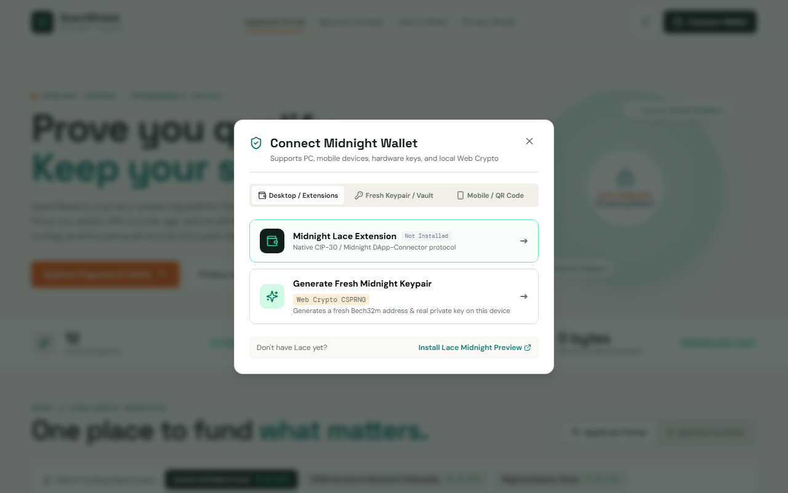
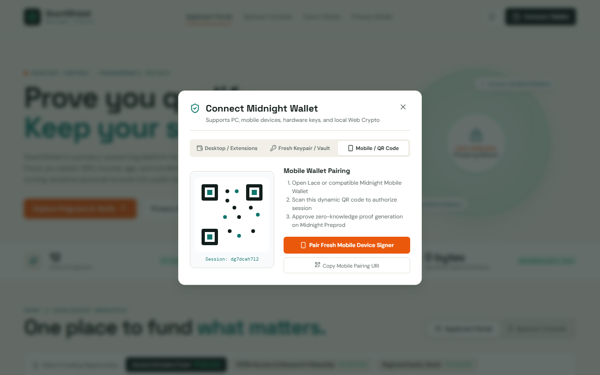
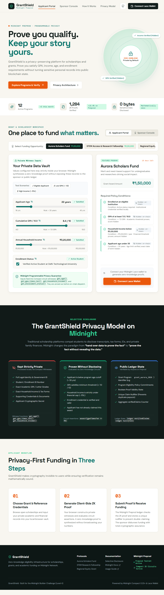
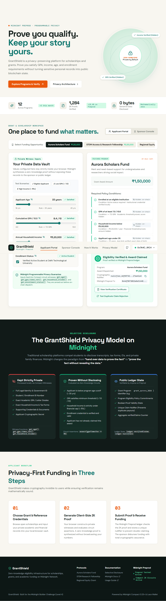
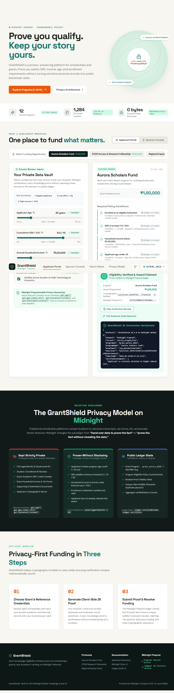
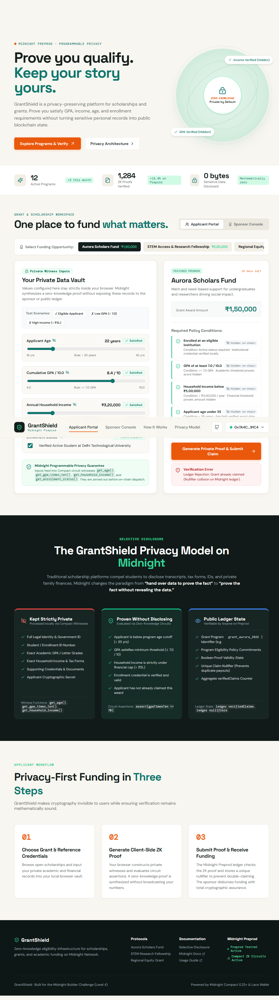
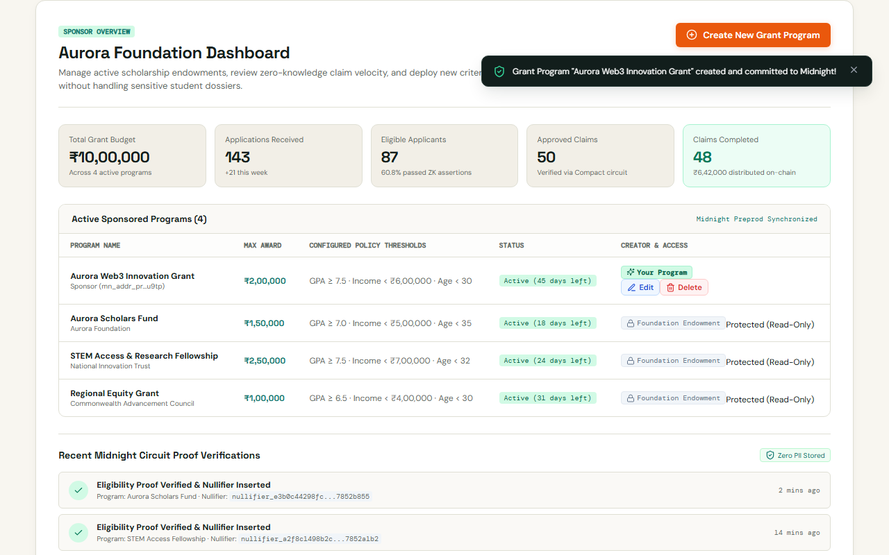

# How to Use GrantShield

> A step-by-step user guide for applicants and sponsors to verify and disburse grants with zero-knowledge privacy on Midnight Network.

---

## What You Need

Before getting started, ensure you have:
1. **A Modern Web Browser:** Google Chrome, Brave, Mozilla Firefox, or Microsoft Edge.
2. **Lace Wallet (Midnight Preview):** The official browser extension wallet for Midnight testnets.
3. **Funded Testnet Account:** A few `tDUST` tokens on **Midnight Preprod** to submit zero-knowledge circuit transactions.
4. **Academic & Financial Credentials:** Your GPA, age, annual household income, and enrollment status (these remain strictly on your local computer).

---

## Step-by-Step Guide

### 1. Connect Your Midnight Wallet (PC, Mobile & Tablet)
1. Open the GrantShield web application in your browser (`http://localhost:5173` or live Preprod demo).
2. Click the **"Connect Wallet"** button located in the top-right corner of the navigation bar (or via the mobile drawer).
3. Choose your preferred connection method:
   - **PC / Desktop Browser Extension:** Select **"Midnight Lace Extension"** to pair via `window.midnight.mnLace`.
   - **Mobile Smartphone / Tablet:** Select **"Mobile Wallet (QR / Deep Link)"** to scan the interactive QR code with your mobile Midnight wallet or tap to deep-link (`midnight://connect`).
   - **Sandbox Dev Keystore:** Select **"Testnet Dev Keystore"** to test with an instant, pre-funded testnet account (1,250 tDUST) on any device without installing extensions.
4. Your formatted testnet address (e.g. `mn_addr_preprod1qq9v...p3w7q`) and balance will appear in the top-right status pill.

---

### 2. Select a Grant or Scholarship Opportunity
1. Under the **"Applicant Portal"** workspace, choose a funding program from the selector bar:
   - **Aurora Scholars Fund:** ₹1,50,000 max award (Merit & Need-based)
   - **STEM Access & Research Fellowship:** ₹2,50,000 max award (Engineering & Science)
   - **Regional Equity Grant:** ₹1,00,000 max award (First-generation scholars)
2. Review the public program policy and required criteria displayed in the right-hand panel.

---

### 3. Configure Your Private Credentials
1. In the **"Your Private Data Vault"** panel on the left, adjust your sliders or inputs:
   - **Applicant Age:** e.g. `22 years` (Must be `< 35 years`)
   - **Cumulative GPA:** e.g. `8.4 / 10.0` (Must be `≥ 7.0 / 10.0`)
   - **Annual Household Income:** e.g. `₹3,20,000` (Must be `< ₹5,00,000`)
   - **Enrollment Status:** Toggle active student enrollment.
2. Notice the real-time assertion status pills next to each criteria:
   - A green **"Satisfied"** badge indicates your local credentials pass the program's mathematical constraints.
   - If any criteria is not met, a warning tag immediately informs you before anything touches the network.
3. You can also click the quick **"Test Scenarios"** buttons (`✓ Eligible Applicant`, `✗ Low GPA`, `✗ High Income`) to test different scenarios instantly.

---

### 4. Generate Zero-Knowledge Proof & Claim
1. Click **"Generate Private Proof & Submit Claim"**.
2. GrantShield initiates the client-side Compact circuit execution:
   - **Step 1 — Witnessing:** Compiles your private inputs into private witness registers (`get_age()`, `get_gpa_times_ten()`, `get_household_income()`, `get_enrollment_status()`).
   - **Step 2 — Proving:** Evaluates the circuit assertions and computes a unique cryptographic nullifier.
   - **Step 3 — Submitting:** Submits the proof envelope and nullifier to the Midnight Preprod smart contract.
3. Upon confirmation, a green **"Eligibility Verified & Award Claimed"** card will appear with your claim confirmation, unique nullifier hash, and transaction hash.

---

### 5. Inspect or Export Your Attestation Certificate
1. Click **"View Verification Certificate"** to inspect the selective disclosure receipt.
2. Confirm that sensitive fields (`applicantAge`, `applicantGpa`, `applicantIncome`, `applicantIdentity`) are mathematically redacted and marked as `[REDACTED BY ZERO-KNOWLEDGE PROOF]`.
3. Only the program ID, cryptographic nullifier, timestamp, and verification statements are present.

---

### 6. Test Duplicate Claim Prevention (Nullifier Shield)
1. In the claim card, click **"Test Duplicate Claim Rejection"**.
2. GrantShield attempts to submit a second claim using the identical cryptographic nullifier.
3. The Midnight contract's `assert(!nullifiers.member(nullifier))` circuit catches the duplicate on-chain, rejecting the payout while keeping your identity private.

---

### 7. Sponsor Console (For Institutions & Donors)
1. Click the **"Sponsor Console"** tab at the top of the workspace.
2. Sponsors can monitor:
   - Total Grant Budget and disbursements
   - Application velocity and pass rates
   - Live verified claim nullifiers (without student PII)
3. Click **"Create New Grant Program"** to define custom GPA, age, and income thresholds for a new endowment.

---

## What Gets Proved (and What Stays Private)

| Data Point | What Verifier / Sponsor Sees | What Actually Exists on Device | Privacy Mechanism |
| :--- | :--- | :--- | :--- |
| **Cumulative GPA** | Hidden (`✓ GPA >= 7.0 Satisfied`) | `8.4 / 10.0` (or exact marks) | Private Witness `get_gpa_times_ten()` |
| **Family Income** | Hidden (`✓ Income < ₹5,00,000 Satisfied`) | `₹3,20,000 / year` | Private Witness `get_household_income()` |
| **Applicant Age** | Hidden (`✓ Age < 35 Satisfied`) | `22 years` (DOB) | Private Witness `get_age()` |
| **Enrollment** | Hidden (`✓ Active Enrollment Satisfied`) | University Roll No & Student ID | Private Witness `get_enrollment_status()` |
| **Claim Uniqueness** | `nullifier_4df65742...27ae41e4` | Private secret key & Grant ID | Poseidon Nullifier Hash |
| **Ledger State** | `verifiedClaims: 49` | None | Public Ledger Counter |

---

## Troubleshooting

### 1. "Wallet connection failed or not detected"
- Ensure the Lace wallet extension (Midnight Preview) is installed and enabled in your browser.
- Verify your network is set to **Midnight Preprod**.
- Refresh the page and click "Connect Lace Wallet".

### 2. "Circuit Assertion Failed"
- If you see `GPA requirement not satisfied` or `Income requirement not satisfied`, your local values do not meet the minimum thresholds for that grant.
- Remember: **this check happened locally on your computer**. No failure was logged on-chain, and your private data was never sent to anyone.

### 3. "Grant already claimed (Nullifier collision)"
- You have already submitted and claimed this grant using your credentials.
- The Midnight contract enforces one payout per applicant per program to ensure fair distribution.

### 4. "Compact compilation error"
- If developing locally, ensure Compact 0.5.2 is installed in your PATH or WSL environment.
- Run `npm run compile` to regenerate artifacts in `managed/`.
